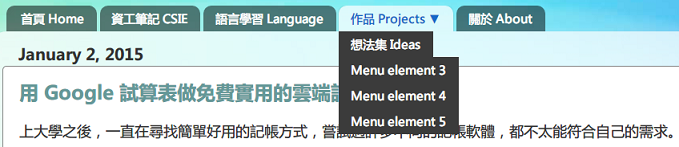
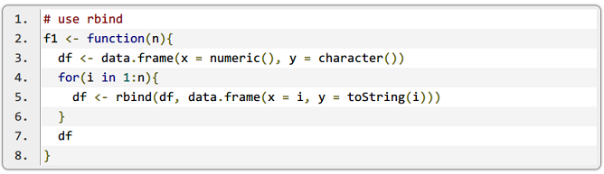
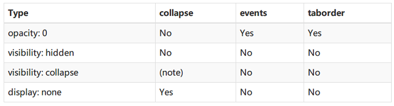
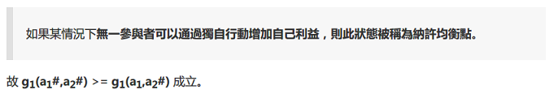

## What is this?

This is the theme for my [blog](http://blog.chunnorris.cc/).

It is based on the default "Picture Window" template from [blogger](https://www.blogger.com/home), with some modification:

- Added a neat Dropdown menu tabs modified from [helplogger](http://helplogger.blogspot.in/2014/02/add-a-neat-css-dropdown-menu-in-blogger.html).

- Added [google-code-prettify](https://code.google.com/p/google-code-prettify) code highlight, and a customized CSS snippet modified from [this blog](http://eric0806.blogspot.tw/2014/04/blogger-google-code-prettify.html).

- Added customized CSS(Table, Blockquote) modified from [Bootstrap](http://getbootstrap.com/).

- The width, layout, font-size, font-family, and others have also been modified based on my own preference.


## Customized Neat-Menu

Customized CSS **Neat-Menu** is just above `]]></b:skin>`, or you can search for: `<!-- neatMenu CSS starts -->`

To modify items of neat-menu(e.g. add tabs, add dropdown lists), go to `Layout`, click `Neat Menu`, then edit HTML.

```html
<div id='contact-links'>
    <div id='menu-container'>
        <nav id='neat-menu'>
          <ul>
            <li><a href='/'>Home</a></li>
            <li><a href='linkToYourPage'>My Page</a></li>
            <li><a>Dropdown lists ▼</a>
                <ul>
                    <li><a href='#'>Item 1</a></li>
                    <li><a href='#'>Item 2</a></li>
                    <li><a href='#'>Item 3</a></li>
                </ul>
            </li>
            <li><a href='#'>Another Page</a></li>
          </ul>
        </nav>
    </div>
</div>
```




## Customized Google Code Prettify

Customized **Google Code Prettify** can be located under:

- `<!-- googleCodePrettify CSS starts -->`
- `<!-- googleCodePrettify javascript starts -->`




## Customized Bootstrap-Style CSS

Customized **Bootstrap-Style Table** can be located under:

- `<!-- bootstrapTable javascript starts -->`

It uses the style from `bootstrap-table.css` in this repository.





## Other Modification Notes

.post-body {
  font-size: 130%;
}

.content-outer{
  font-size: 90%;
}
